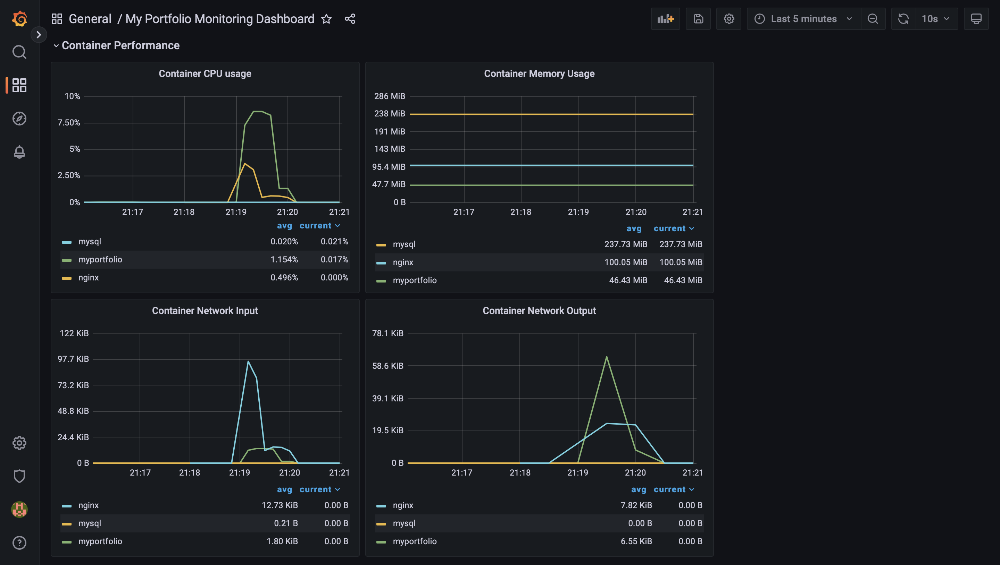
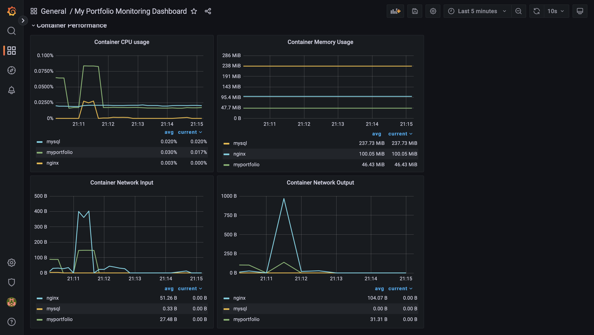

# A Portfolio Website
This portfolio site is created for the Summer 2022 MLH Fellowship. 

## Installation
Create a .env file using the example.env template (make a copy using the variables inside of the template)

There are several ways to get the site running locally.

### 1: Virtual Environment
Make sure you have python3 and pip installed

Create and activate virtual environment using virtualenv
```bash
$ python -m venv python3-virtualenv
$ source python3-virtualenv/bin/activate
```

Use the package manager [pip](https://pip.pypa.io/en/stable/) to install all dependencies!

```bash
pip install -r requirements.txt
```

#### Usage

Start flask development server
```bash
$ export FLASK_ENV=development
$ flask run
```

You should get a response like this in the terminal:
```
❯ flask run
 * Environment: development
 * Debug mode: on
 * Running on http://127.0.0.1:5000/ (Press CTRL+C to quit)
```

You'll now be able to access the website at `localhost:5000` or `127.0.0.1:5000` in the browser! 

### 2: Docker
Get the images ready to create and run the containers
```
docker compose -f docker-compose.yml up 
```

You should get a response for the myportfolio container like this in the terminal:
```
myportfolio  |  * Environment: development
myportfolio  |  * Debug mode: on
myportfolio  |  * Running on all addresses.
myportfolio  |    WARNING: This is a development server. Do not use it in a production deployment.
myportfolio  |  * Running on http://172.19.0.3:5000/ (Press CTRL+C to quit)
myportfolio  |  * Restarting with stat
myportfolio  |  * Debugger is active!
myportfolio  |  * Debugger PIN: 573-439-151
```

You'll now be able to access the website at `localhost:5000` or `127.0.0.1:5000` in the browser! 

## System Monitoring
Some examples of monitoring using Grafana to visualize metrics gathered from Prometheus


